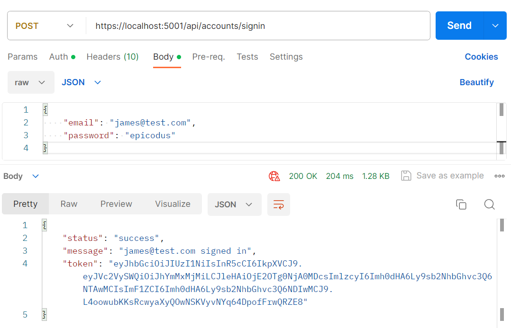
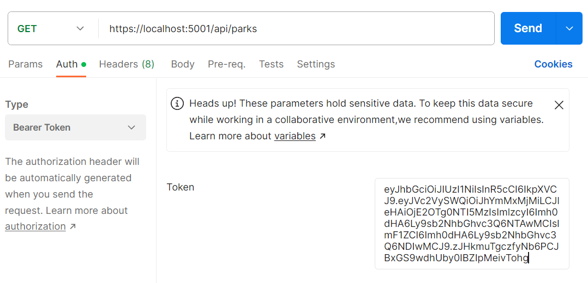
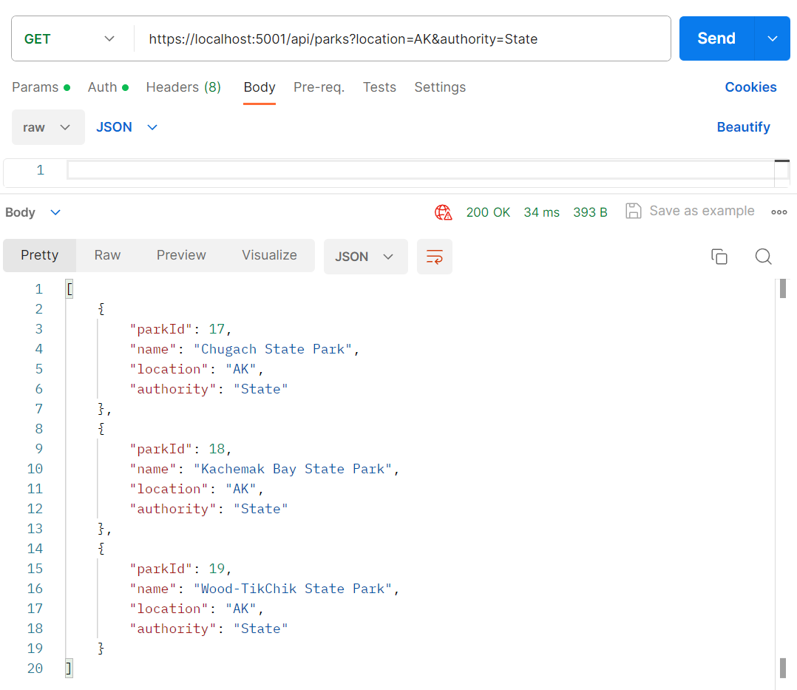
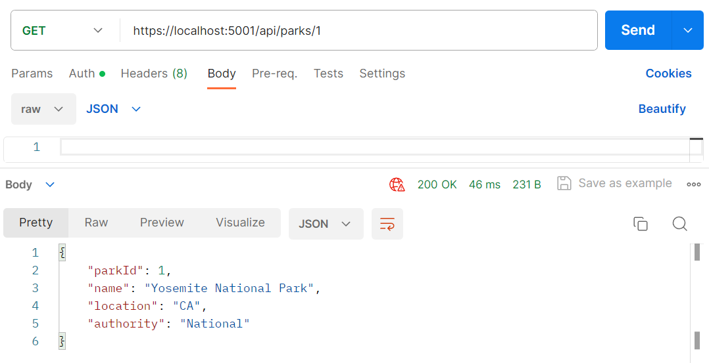
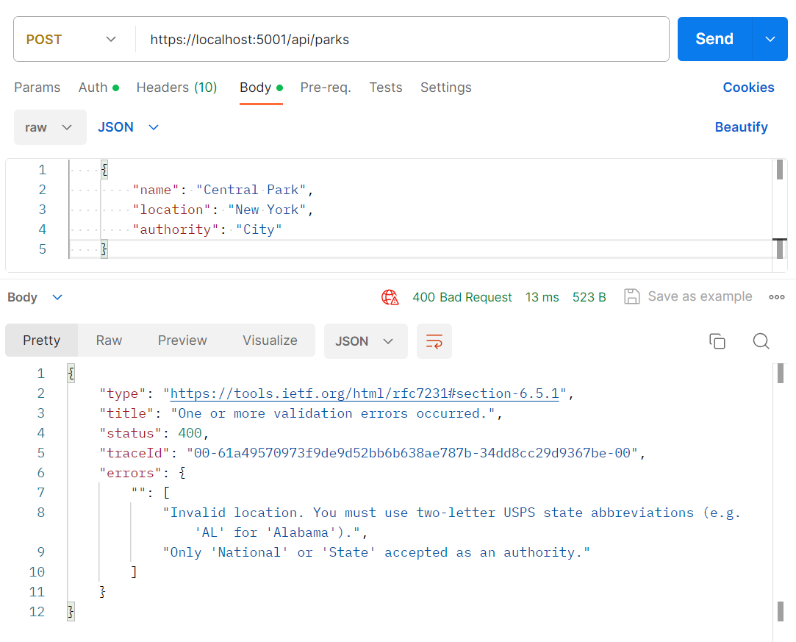

# Parks Lookup API 

------------------------------
## <u>Table of Contents</u>
* <a href="#🌐-about-the-project">About the Project</a>
    * <a href="#📖-description">Description</a>
    * <a href="#🦠-known-bugs">Known Bugs</a>
    * <a href="#🛠-built-with">Built With</a>
    <!-- * <a href="#🔍-preview">Preview</a> -->
* <a href="#🏁-getting-started">Getting Started</a>
    * <a href="#📋-prerequisites">Prerequisites</a>
    * <a href="#⚙️-setup-and-use">Setup and Use</a>
* <a href="#🛰️-api-documentation">API Documentation</a>
* <a href="#⚖️-license">Auxiliary</a>
    * <a href="#⚖️-license">License</a>

    
------------------------------

## 🌐 About the Project

### 📖 Description
An ASP.NET Web API that allows the user to look up national and state parks and take advantage of full CRUD (Create Read Update Delete) functionality following RESTful principles. The API utilizes Json web tokens (JWT) for authentication, making the API accessible only to signed-in users. The API can be accessed using Postman.

### 🦠 Known Bugs

* No known bugs.

### 🛠 Built With
* [Visual Studio Code](https://code.visualstudio.com/)
* [C#](https://docs.microsoft.com/en-us/dotnet/csharp/)
* [ASP.NET Core MVC](https://docs.microsoft.com/en-us/aspnet/core/mvc/overview?view=aspnetcore-3.1)
* [MySQL 8.0.34](https://dev.mysql.com/)
* [Entity Framework Core 6.0.0](https://docs.microsoft.com/en-us/ef/core/)
* [Entity Framework Core CLI Tools 6.0.0](https://learn.microsoft.com/en-us/ef/core/cli/dotnet)
* [Postman](https://www.postman.com/)

------------------------------

## 🏁 Getting Started

### 📋 Prerequisites

#### Install .NET Core
* On macOS Mojave or later
  * [Click here](https://dotnet.microsoft.com/download/thank-you/dotnet-sdk-2.2.106-macos-x64-installer) to download the .NET Core SDK from Microsoft Corp for macOS.
* On Windows 10 x64 or later
  * [Click here](https://dotnet.microsoft.com/download/thank-you/dotnet-sdk-2.2.203-windows-x64-installer) to download the 64-bit .NET Core SDK from Microsoft Corp for Windows.

#### Install dotnet script
 Enter the command ``dotnet tool install -g dotnet-script`` in Terminal for macOS or PowerShell for Windows.

#### Install dotnet-ef
For Entity Framework Core, we'll use a tool called dotnet-ef to reference the project's migrations and update our database accordingly. To install this tool globally, run the following command in your terminal:

```
$ dotnet tool install --global dotnet-ef --version 6.0.0
```

Optionally, you can run the following command to verify that EF Core CLI tools are correctly installed:

```
$ dotnet ef
```

#### Install MySQL Workbench
This project assumes you have MySQL Server and MySQL Workbench installed on your system. If you do not have these tools installed, follow along with the installation steps for the the necessary tools introduced in the series of lessons found here on [LearnHowToProgram](https://full-time.learnhowtoprogram.com/c-and-net/getting-started-with-c/installing-and-configuring-mysql).

[Download and install the appropriate version of MySQL Workbench](https://dev.mysql.com/downloads/workbench/).

#### Install Postman
[Download and install Postman](https://www.postman.com/downloads/).

#### Code Editor

  To view or edit the code, you will need a code editor or text editor. A popular open-source choice for a code editor is VisualStudio Code.

  1) Code Editor Download:
     * [VisualStudio Code](https://code.visualstudio.com/)
  2) Click the download most applicable to your OS and system.
  3) Wait for download to complete, then install -- Windows will run the setup exe and macOS will drag and drop into applications.
  4) Optionally, create a [GitHub Account](https://github.com)

### ⚙️ Setup and Use

  #### Cloning

  1) Navigate to the [Parks Lookup Api repository here](https://github.com/rbarcode/w13_parks_api.git).
  2) Click 'Clone or download' to reveal the HTTPS url ending with .git and the 'Download ZIP' option.
  3) Open up your system Terminal or GitBash, and if necessary, navigate to whichever location suits you best using the `cd` command.
  4) Clone the repository to your desktop: `$ git clone https://github.com/rbarcode/w13_parks_api.git`
  5) Run the command `cd w13_parks_api/ParksApi` to enter into the project directory.
  6) View or Edit:
      * Code Editor - Run the command `code .` to open the project in VisualStudio Code for review and editing.
      * Text Editor - Open by double clicking on any of the files to open in a text editor.

  #### Download

  1) Navigate to the [Parks Lookup Api repository here](https://github.com/rbarcode/w13_parks_api.git).
  2) Click 'Clone or download' to reveal the HTTPS url ending with .git and the 'Download ZIP' option.
  3) Click 'Download ZIP' and extract.
  4) Open by double clicking on any of the files to open in a text editor.

  #### AppSettings

  1) Create a new file in the ParksApi project directory named `appsettings.json`
  2) Add in the following code snippet to the new `appsettings.json` file:
  
  ```
{
    "Logging": {
        "LogLevel": {
        "Default": "Warning"
        }
    },
    "AllowedHosts": "*",
    "ConnectionStrings": {
        "DefaultConnection": "Server=localhost;Port=3306;database=parks_api;uid=[YOUR-USERNAME-HERE];pwd=[YOUR-PASSWORD-HERE];"
    },
    "JWT": {
        "ValidAudience": "example-audience",
        "ValidIssuer": "example-issuer",
        "Secret": "[YOUR-SECRET-HERE]"
    }
}
  ```
  3) Change the server, port, and user id as necessary. Replace `[YOUR-USERNAME-HERE]` and `[YOUR-PASSWORD-HERE]` with your personal MySQL username and password (set at installation of MySQL).
  4) To properly implement JSON Web Tokens for API authorization, replace `[YOUR-SECRET-HERE]` with your own personalized string.
     1) NOTE: The `Secret` is a special string that will be used to encode our JWTs, to make them unique to our application. Depending on what type of algorithm being used, the Secret string will need to be a certain length. **In this case, it needs to be at least 16 characters long**. 
   
  #### Database
  1) From the ParksApi directory, run the command `dotnet ef database update` in the terminal to generate the database through Entity Framework Core.
  2) (Optional) To update the database with any changes to the code, run the command `dotnet ef migrations add <MigrationsName>` which will use Entity Framework Core's code-first principle to generate a database update. After, run the previous command `dotnet ef database update` to update the database.

  #### Launch the API
  1) From the ParksApi directory in the terminal, run the command `dotnet watch run` to have access to the API in Postman.

------------------------------

## 🛰️ API Documentation
Explore the API endpoints in Postman. You will **not** be able to utilize authentication in a browser/Swagger.

### Using the JSON Web Token
In order to be authorized to use the GET, POST, PUT, and DELETE functionality of the API, please authenticate yourself through Postman.

#### SignIn
The database is already seeded with two dummy accounts. There is no registration functionality.  

Setup a `POST` request to the `https://localhost:5000/api/accounts/signin` endpoint. Select the 'Body' tab, choose the 'raw' radio button, and select 'JSON' from the dropdown selection.

In the Body of the Post request, use the following login information and format:
```
{
    "email": "mary@test.com",
    "password": "epicodus"
}
```
Alternatively you can use the second dummy account:
```
{
    "email": "james@test.com",
    "password": "epicodus"
}
```

#### Query Endpoint
```
https://localhost:5000/api/accounts/signin
```

#### Sample JSON Response
```
{
    "status": "success",
    "message": "email@test.com signed in.",
    "token": "xxxx.xxxx.xxxx"
}
```
<div align="center">
  
</div>

#### Using the JSON Web Token
The token from the response must be added as an authorization header to all request further requests to the `https://localhost:5000/api/parks` endpoint. Copy the token from the body, and click on the Authorization tab in Postman. On the 'Type', make sure that is set to 'Bearer Token', and then paste in the token in the field on the right.

<div align="center">
  
</div>

Until the Token expires, you should now have access to all endpoints requiring user authorization.

..........................................................................................

### API Endpoints
Base URL: `https://localhost:5001`

#### SignIn

```
POST /api/accounts/signin
```

#### Queries
```
GET /api/parks
POST /api/parks
GET /api/parks/{id}
PUT /api/parks/{id}
DELETE /api/parks/{id}
```

#### Path Parameters for **GET /api/parks** and Searching by Park ID

Querying the /api/parks endpoint without any optional parameters will return a list of all parks in the database.

Alternatively, you can search by location and/or by type of park. To search by location, include a question mark after api/parks and the string "location={state}", where {state} is the two-letter USPS state abbreviation. To search by type of park (national or state), include the string "authority={authority}" where {authority} is either "National" or "State". If including both parameters in a search, the parameters are joined by an ampersand sign (&).  

| Parameter | Type | Default | Required | Description |
| :---: | :---: | :---: | :---: | --- |
| location | string | none | false | Return matches by state.
| authority | string | none | false | Return matches by national or state parks. |
 
#### Example Query
```
https://localhost:5001/api/parks?location=AK&authority=State
```

#### Sample JSON Response
<div align="center">
  
</div>  
    

Finally, the user can make a GET call for a specific park by including the park's ID in the endpoint: `https://localhost:5001/api/parks/{id}`  

<div align="center">
  
</div>

#### Making POST and PUT Requests  

POST and PUT Requests must include the "name", "location" and "authority" fields in the body of the request.  

The API contains model validation for the location and authority fields. Thus, it is important that the user includes the correct type of information and correct formatting when making POST or PUT requests. The requirements are the same as querying with parameters (see above). The location must be a two-letter USPS state abbreviation and the authority must be either "National" or "State". An error will be returned otherwise.

#### Sample POST Request and JSON Response to a Bad Request  
<div align="center">
  
</div>  

A POST request is made to api/parks endpoint while a PUT request must include the park's ID in the endpoint: api/parks/{id}.

#### Making DELETE Requests  

Similar to PUT requests, a DELETE request must be made to an endpoint that includes the ID of the park that the user wishes to delete: api/parks/{id}. Unlike the POST or PUT requests, a DELETE request does not require a body.

------------------------------

### ⚖️ License


MIT License

Copyright (c) 2023 JRichard Barbour.

Permission is hereby granted, free of charge, to any person obtaining a copy of this software and associated documentation files (the "Software"), to deal in the Software without restriction, including without limitation the rights to use, copy, modify, merge, publish, distribute, sublicense, and/or sell copies of the Software, and to permit persons to whom the Software is furnished to do so, subject to the following conditions:

The above copyright notice and this permission notice shall be included in all copies or substantial portions of the Software.

THE SOFTWARE IS PROVIDED "AS IS", WITHOUT WARRANTY OF ANY KIND, EXPRESS OR IMPLIED, INCLUDING BUT NOT LIMITED TO THE WARRANTIES OF MERCHANTABILITY, FITNESS FOR A PARTICULAR PURPOSE AND NONINFRINGEMENT. IN NO EVENT SHALL THE AUTHORS OR COPYRIGHT HOLDERS BE LIABLE FOR ANY CLAIM, DAMAGES OR OTHER LIABILITY, WHETHER IN AN ACTION OF CONTRACT, TORT OR OTHERWISE, ARISING FROM, OUT OF OR IN CONNECTION WITH THE SOFTWARE OR THE USE OR OTHER DEALINGS IN THE SOFTWARE.


------------------------------

<center><a href="#">Return to Top</a></center>